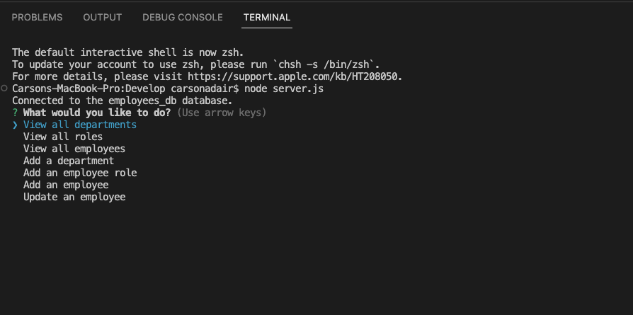
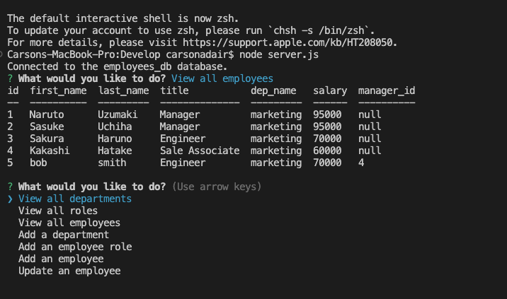
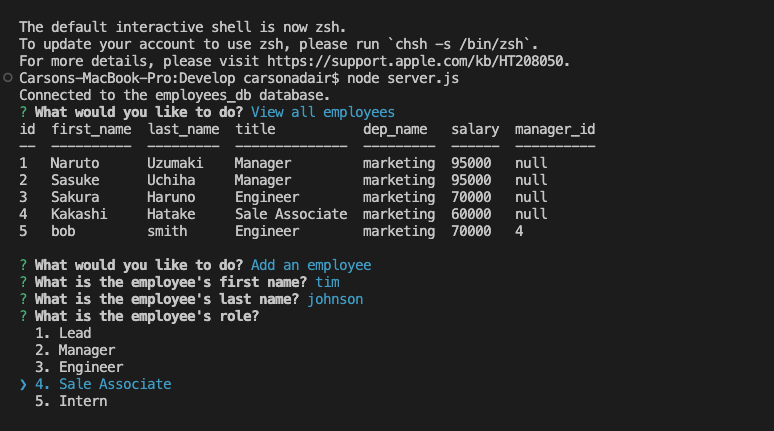
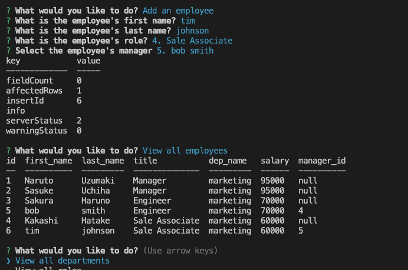

# 12 SQL: Employee Tracker

This project utilized MySQL to create a database that can be edited with information about a company's employees, roles, and departments. 
The project uses the command line to prompt questions using Inquirer. It then shows a series of options to choose from, including viewing all departments, roles and salaries, and employees.
It then allows the user to add a new department, a new role with a new salary, or a new employee and saves the information to the database. 
Finally, there is an option to update an existing employee's role and adjusts the database accordingly. 

Here is a link to the video walk through of the application.
https://drive.google.com/file/d/1fk0wxH5MZ6H6ZR6CRf9ACsecC_xplzJD/view

And here are screenshots of the application in use. 

